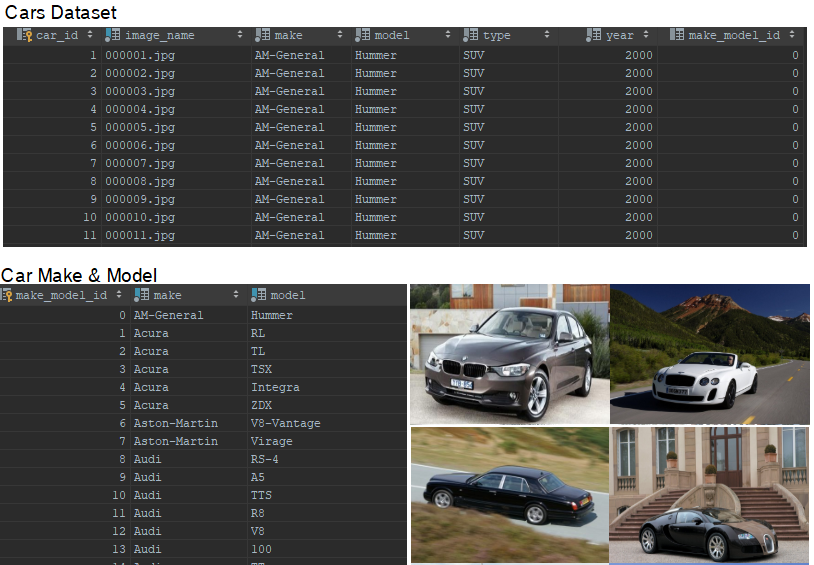
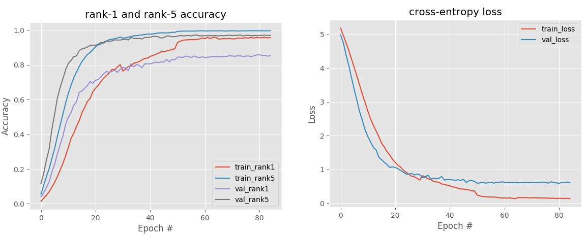
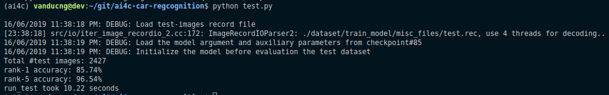
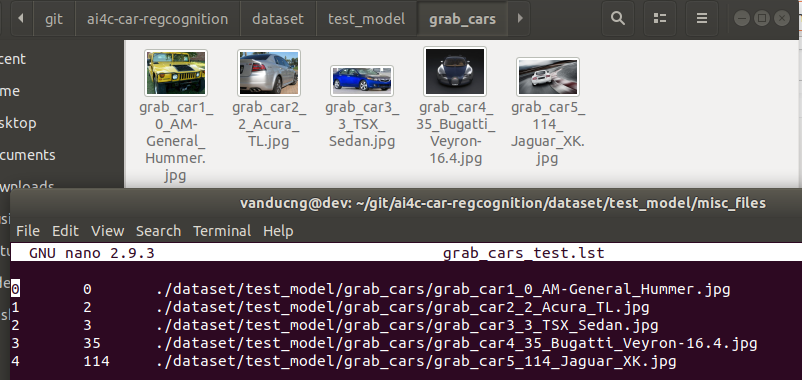

# Car Regcognition

## Introduction

This project aims at recognizing the car make and model based on a Stanford Cars Dataset with 16,185 images. This dataset includes information about car make, model, and year (Eg. 2012 Tesla Model S) with 196 different classes. However, in this project we target to identify the car make and model only; this results in 164 different classes in total.

<p align="center">
  
</p>

## Approach

The transfer learning technique is used to produce the model for this dataset because of fairly small data size. Further than that, we are able to achieve a good accuracy with less training time. And the VGGNet is used as the network for this technique as its comparitive performance over other networks (Ref [HERE](https://neurohive.io/en/popular-networks/vgg16/)).

The VGG CNN was first introduced by Simonyan and Zisserman in their 2014 paper, [Very Deep Convolutional Networks for Large Scale Image Recognition](https://arxiv.org/pdf/1409.1556.pdf)
The network achitechture is comprised of 13 convolution and 3 FC layers as below.

<p align="center">
  
</p>

## Result

The main effort paying for transfer learning technique is to do fine-tuning the network to get better result (higher accuracy with lower loss).
With number of experiments, the final model is selected at epoch 85 with the learning rate of 5e-5 for epoch 1->50 & 1e-5 from 51->85. This selection is to lower the chance of overfitting when accuracy reached ~85% rank1 accuracy.

<p align="center">
  
</p>

The result obtained for the test set is 85.74% for rank1 and 96.54% for rank5.

<p align="center">
  
</p>

## Usage

### Setup environment

This project uses python 3.6.8 & virtualenv to create virtual environment name (ai4c).

```bash
$ sudo apt-get install python3-pip
$ sudo pip3 install virtualenv
$ virtualenv ai4c
$ source ai4c/bin/activate
```

If you are using other python version (>3.6), please be noted to update the IM2REC_PY_PATH.

```
IM2REC_PY_PATH = "ai4c/lib/python3.6/site-packages/mxnet/tools/im2rec.py"
```

### Install required packages

Once (ai4c) environment is activated, installed required packages as listed in `requirement.txt`. It is important to setup version of packages to prevent unexpected incompatible errors.

```bash
pip install -r requirements.txt
```

### Prepare dataset

The directory looks as below, however we need to download 3 more additional files to get the project fully operation for pre-process, train & test.

- Full statandford car dataset: http://imagenet.stanford.edu/internal/car196/car_ims.tgz
- Pretrain VGGNet model: https://1drv.ms/u/s!ApCwaWTCCxjag6lgxPQL1K-H--mUYg?e=Yxo9zI
- My own model (this is the training result): https://1drv.ms/u/s!ApCwaWTCCxjag6lhHlAq1pjOCu69Ow?e=kFhdlS

Note:

- All images from car dataset are to put into `dataset/train_model/car_ims`
- The pre-trained files (vgg16-0000.params & vgg16-symbol.json) will be put in `./vgg16` folder
- The model used for testing is supposed to be located in `./checkpoints` folder

```bash
.
├── checkpoints
├── config.py
├── dataset
│   ├── test_model
│   │   ├── grab_cars
│   │   │   ├── grab_car1_0_AM-General_Hummer.jpg
│   │   │   ├── grab_car2_2_Acura_TL.jpg
│   │   │   ├── grab_car3_3_TSX_Sedan.jpg
│   │   │   ├── grab_car4_35_Bugatti_Veyron-16.4.jpg
│   │   │   └── grab_car5_114_Jaguar_XK.jpg
│   │   └── misc_files
│   │       ├── grab_cars_test.idx
│   │       ├── grab_cars_test.lst
│   │       ├── grab_cars_test.rec
│   │       └── make_model_labels.csv
│   └── train_model
│       ├── car_ims
│       └── misc_files
│           ├── test.lst
│           ├── train.lst
│           └── val.lst
├── db_design
│   ├── db.sqlite
│   └── full_dataset.csv
├── logs
│   ├── preprocessing.log
│   ├── testing_85.log
│   └── training_50.log
├── media
├── preprocess.py
├── README.md
├── requirements.txt
├── test.py
├── train.py
├── utils.py
└── vgg16
```

### How to start the test with images not in original dataset (car_ims.tgz)

- Put all desired photos to be tested in `./dataset/test_model/grabcars`
- Prepare the `grab_cars_test.lst` file in `./dataset/test_model/misc_files` as a input for mxnet library to produce `.rec` files for testing process. There are available sample of `.lst` files for reference. The structure of list file is as below (refer [HERE](https://mxnet.incubator.apache.org/versions/master/faq/recordio.html)):
  > integer_image_index \t label_index \t path_to_image

<p align="center">
  
</p>

For the label_index, please use the label column for reference from `make_model_labels.csv` in same directory.

<p align="center">
  
</p>

- It is necessary to specify the hardware of your system for the test evaluation in the config file. It is recommended to use GPU for faster processing time. For example, with 'MODEL_PROCESS_CONTEXT = [mx.gpu(0)]' which means that we are going to use one GPU. It is possible to run a list of multiple devices.

- Once the setup is done, execute 'python test.py -m grab_test'. There will be 2 files 'grab_cars_test.rec' and 'grab_cars_test.idx' generated in same folder with `lst` file. Then the model is loaded (vggnet-0085.params) to identify and evaluate the rank1 & rank5 accuracy.
